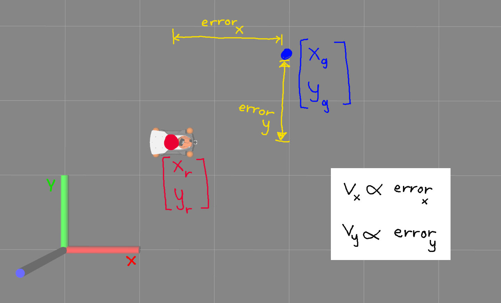
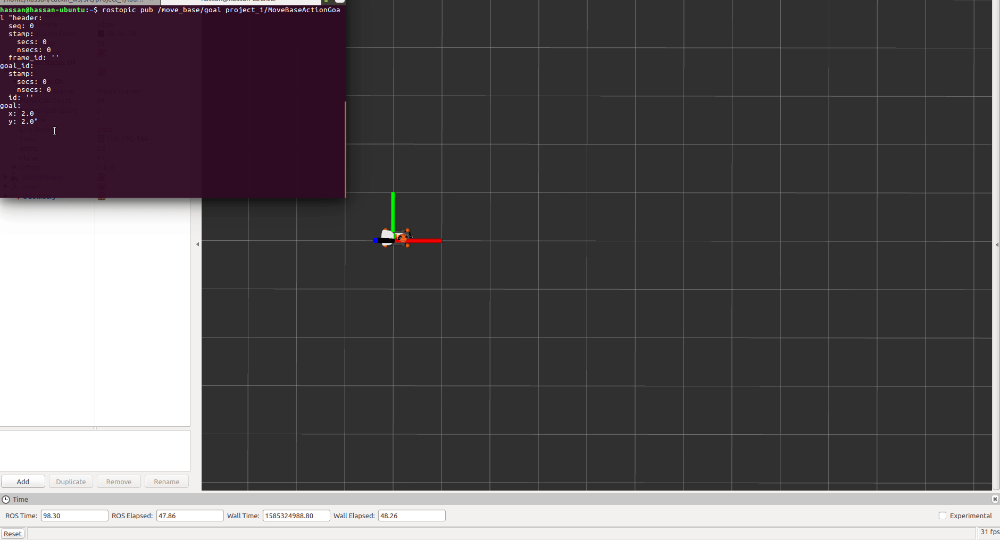

# :fire: Project 1

The goal was to make the robot go to a point


## idea:

- find error in the x direction
- find error in y direction
- set x speed to a value proportional to error_x
- set y speed to a value proportional to error_y

:warning: we assume robot doesn't rotate, and we only send v_x and v_y.




## How to run this sample solution


- call this launch file:

  ```bash
  roslaunch project_1 all.launch
  ```

  this launch file will bring up Gazebo, Rviz, and the action server node.

  :bulb: the launch file loads Rviz with a configuration file that shows odometry topic. It shows the actual robot path.

- to send a point, publish on the `/move_base/goal` topic:

  ```
  rostopic pub /move_base/goal project_1/MoveBaseActionGoal "header:
    seq: 0
    stamp:
      secs: 0
      nsecs: 0
    frame_id: ''
  goal_id:
    stamp:
      secs: 0
      nsecs: 0
    id: ''
  goal:
    x: 2.0
    y: 2.0"
  ```





**Note**

- `rviz.launch` file is just like `all.launch` but without Gazebo GUI.
- `gazebo.launch` file is just like `all.launch` but without Rviz.